# NVH Source Locator — Korisnički priručnik

NVH Source Locator je mjerni alat za lociranje izvora buke i vibracija pomoću TDOA (Time Difference of Arrival) iz signala akcelerometra zabilježenih na osciloskopu ili mjernom sustavu.

Ovaj priručnik pokriva sve značajke. Za kratki podsjetnik pogledajte **Kratki priručnik**.

---

## Sadržaj

1. [Kako radi](#how-it-works)
2. [Prije nego što počnete](#before-you-start)
3. [Glavne kartice](#the-main-tabs)
4. [Način 2-Sensor](#2-sensor-mode)
5. [Način 3-Sensor](#3-sensor-mode)
6. [Načini Pro+ (3-Sen+, 4-Sensor, 4-Sen+, 3D, 3D+)](#pro-modes)
7. [Kartica Materials](#the-materials-tab)
8. [Temperaturna kompenzacija](#temperature-compensation)
9. [Označavanje fotografije](#photo-annotation)
10. [Izvješća](#reports)
11. [Sigurnosna kopija i vraćanje](#backup-and-restore)
12. [Postavke](#settings)
13. [Pro značajke](#pro-features)
14. [Kartica Help i tutorijali](#help-tab-and-tutorials)
15. [Rješavanje problema](#troubleshooting)

---

## Kako radi

Kad izvor buke emitira zvuk ili vibraciju, val putuje kroz materijal poznatom brzinom. Ako postavite dva ili više akcelerometara na materijal i izmjerite kada val stigne do svakog od njih, vremenska razlika vam govori gdje je izvor.

NVH Source Locator uzima:

- **Kalibraciju**: udaljenost između senzora i vrijeme potrebno da val prijeđe tu udaljenost (koristi se za izračun brzine zvuka materijala)
- **Događaj**: vremensku razliku između senzora koji detektiraju događaj buke/vibracije

Zatim izračunava gdje se izvor nalazi u strukturi.

Što više senzora koristite, to preciznije možete locirati izvor:

- **2 senzora** → udaljenost duž linije
- **3 senzora** → položaj na 2D površini (X, Y)
- **4 senzora** → položaj u 3D prostoru (X, Y, Z)

---

## Prije nego što počnete

Trebat će vam:

- **Osciloskop ili mjerni sustav** koji vam može pokazati vremensku razliku između kanala akcelerometra u mikrosekundama (µs)
- **Najmanje 2 akcelerometra** fizički pričvršćena na strukturu (više senzora = veća točnost)
- **Način mjerenja udaljenosti** između senzora (mjerna traka, šestar)
- **Način pokretanja vala** na poznatoj lokaciji za kalibraciju (kalibrirani udarac čekićem, udarac odvijačem ili drugi poznati signal)

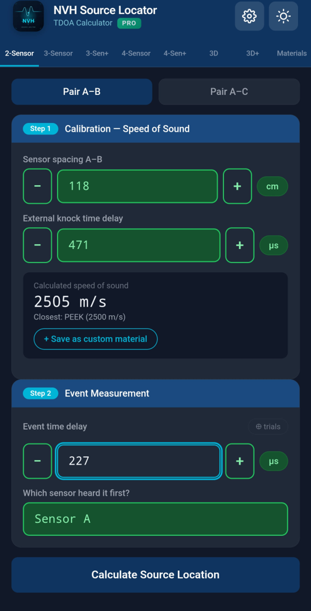

---

## Glavne kartice

Aplikacija ima kartice na vrhu:

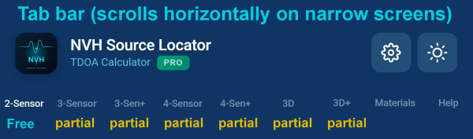

| Kartica | Što radi | Kada koristiti |
|---|---|---|
| **2-Sensor** | 1D lociranje izvora duž linije između 2 senzora | Brze provjere, strukture nalik gredama. **Potpuno besplatno.** |
| **3-Sensor** | 2D lociranje izvora pomoću 3 senzora u trokutu | Najopćenitija upotreba, ploče i površine |
| **3-Sen+** | 3-Sensor s preodređenim rješavačem najmanjih kvadrata | Zahtjevnija mjerenja, otporno na buku |
| **4-Sensor** | 2D lociranje pomoću dva para (A-B + C-D) | Pravokutni rasporedi senzora, unakrsna provjera |
| **4-Sen+** | Napredni 2D način, 4 senzora u bilo kojem položaju | Nepravokutne geometrije, puni LSQ |
| **3D** | 3D lociranje izvora pomoću 4 senzora s XYZ koordinatama | Složene strukture u 3D prostoru |
| **3D+** | 3D s do 6 senzora, preodređeni LSQ | Vrlo složene geometrije, maksimalna preciznost |
| **Materials** | Knjižnica brzine zvuka + prilagođeni materijali | Odaberite jednom po sesiji mjerenja |
| **Help** | Tutorijali u aplikaciji i referenca | Kada vam treba brzi podsjetnik |

> **Besplatno vs Pro**: Kartica 2-Sensor je potpuno besplatna. Druge kartice su dostupne, ali imaju određena polja za unos zaključana za Pro korisnike (označena zlatnom značkom lokota). Dodir zaključanog polja prikazuje Pro paywall.

Postavke su dostupne putem ikone zupčanika ⚙ u gornjem desnom kutu (nije kartica).

---

## Način 2-Sensor

Najjednostavnije mjerenje: lociranje izvora duž linije između dva akcelerometra.

### Korak 1: Primijenite materijal

Dodirnite karticu Materials. Odaberite materijal od kojeg je vaša struktura napravljena (npr. „Aluminij", „Čelik, Mild (1020)"). Aplikacija koristi poznatu brzinu zvuka materijala za automatsko popunjavanje polja vremena kalibracije.

Ako materijal vaše strukture nije na popisu, možete privremeno odabrati „Zrak" i ručno prepisati vrijeme kalibracije u koraku 2.

### Korak 2: Unesite podatke kalibracije

Na kartici 2-Sensor vidjet ćete dvije sekcije parova: **Par A–B** i **Par A–C** (potreban je samo A–B ako imate samo 2 senzora).

Za svaki par popunjavate:

- **Razmak senzora** (`d`): fizička udaljenost između senzora, u cm ili inčima (postavljeno u Postavkama)
- **Kašnjenje vremena kalibracije** (`tCal`): vrijeme potrebno valu da putuje između senzora pri brzini zvuka materijala — automatski popunjeno kada odaberete materijal, ali možete prepisati

### Korak 3: Unesite vrijeme događaja

- **Kašnjenje vremena događaja** (`tEvent`): vremenska razlika između senzora koji detektiraju događaj buke, u mikrosekundama
- **Prvi senzor**: koji senzor je prvi čuo događaj (A ili B)

### Korak 4: Pročitajte rezultat

Aplikacija prikazuje položaj izvora kao udaljenost od senzora A:
- Rezultat = 0: izvor je kod senzora A
- Rezultat = udaljenost: izvor je kod senzora B
- Rezultat između: izvor je između njih
- Rezultat izvana: izvor je iza jednog od senzora (toast će upozoriti)

Kartica rezultata prikazuje obje udaljenosti (od A, od B) i pokazuje koji senzor je bliži.

### Korak 5 (neobavezno): Označite fotografiju

Dodirnite **📷 Označi fotografiju** kako biste fotografirali svoju postavku. Aplikacija postavlja oznake za senzore A, B i izvor. Korisno za izvješća.

---

## Način 3-Sensor

Locira izvor na 2D ravnini koristeći tri senzora raspoređena u trokut.

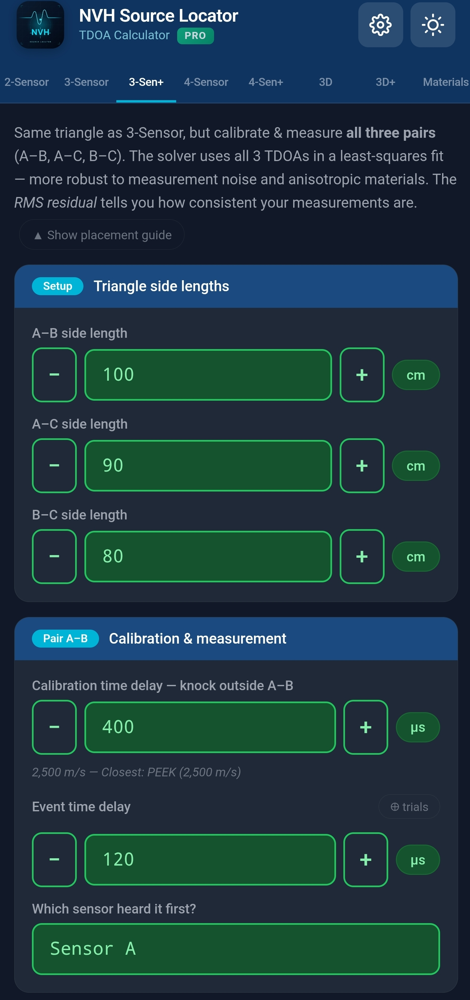

### Postavljanje

Postavite tri senzora na svoju strukturu tvoreći trokut. Jednakostranični, pravokutni ili raznostranični — aplikacija obrađuje sve geometrije.

### Unesite podatke

U sekciji **Duljine stranica trokuta** unesite fizičku udaljenost za sve tri stranice (A–B, A–C, B–C).

Za svaki par (A–B i A–C) unesite:
- **tCal**: vrijeme kalibracije (automatski se popunjava iz materijala)
- **tEvent**: izmjerena vremenska razlika za događaj buke
- **Prvi senzor**: koji je prvi čuo

### Pročitajte rezultat

Aplikacija prikazuje položaj izvora kao koordinate X, Y u odnosu na senzor A (senzor A u ishodištu, senzor B na X osi). Vizualizacija prikazuje sva tri senzora i lokaciju izvora.

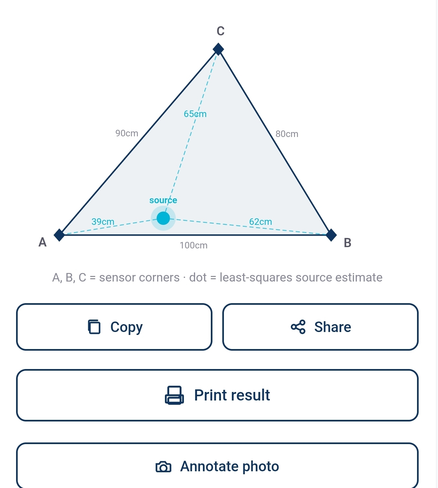

---

## Pro+ načini

Nekoliko naprednih kartica nudi preodređene rješavače i veću dimenzionalnost:

### 3-Sen+ (Pro)

Ista postavka trokuta kao 3-Sensor, ali kalibrirajte I mjerite sva tri para (A–B, A–C, B–C). Rješavač koristi sva 3 TDOA u prilagodbi najmanjih kvadrata — robustnije na mjernu buku i anizotropne materijale. Reziduali po paru se prijavljuju kako biste mogli uočiti nedosljedna mjerenja.

### 4-Sensor

Postavite četiri senzora oko područja:
- **A–B** = horizontalni par (lijeve/desne strane)
- **C–D** = vertikalni par (gornja/donja strane)

Najprije pokrenite par A–B (horizontalni), zatim par C–D (vertikalni). 2D karta prikazuje sjecište. Svaki par se kalibrira odvojeno — korisno kada materijal varira preko strukture.

### 4-Sen+ (Napredni 2D)

Četiri senzora u bilo kojem položaju (nije forsirana pravokutnost). Uparite A sa svakim od B, C, D i kalibrirajte odvojeno. Preodređeni rješavač najmanjih kvadrata uprosječuje mjernu buku po paru i prijavljuje rezidualne vrijednosti po paru.

### 3D

Potpuno 3D mjerenje s 4 senzora smještena u 3D prostoru. Unesite koordinate (X, Y, Z) svakog senzora, plus vremena kalibracije i događaja za svaki par (A–B, A–C, A–D).

### 3D+ (Pro)

Kao 3D, ali podržava do **6 senzora** (A do F) s preodređenim LSQ. Maksimalna preciznost za složene 3D geometrije.

---

## Kartica Materials

Knjižnica uobičajenih inženjerskih materijala s poznatom brzinom zvuka na 20 °C.

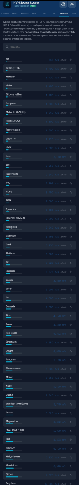

### Popis materijala

Popis uključuje zrak, tekućine, gume, polimere, drvo, stakla i metale. Brzine se kreću od ~340 m/s (zrak) do ~13 000 m/s (neki metali na sobnoj temperaturi).

### Ugrađeni materijali s temperaturnom kompenzacijom

14 često korištenih metala uključuje podatke o temperaturnom koeficijentu. Kada se Referentna temperatura u Postavkama razlikuje od 20 °C, aplikacija automatski prilagođava brzine ovih materijala:

- Aluminij
- Čelik, Mild (1020)
- Nehrđajući čelik (304)
- Željezo (lijevano)
- Željezo
- Bakar
- Mjed
- Bronca
- Titan
- Magnezij
- Olovo
- Cink
- Nikal
- Volfram

Materijali s kompenzacijom prikazuju dvije vrijednosti u izborniku: **kompenziranu brzinu** (velika, istaknuta) i **referentnu brzinu na 20 °C** (mala, siva ispod).

Materijali bez kompenzacije prikazuju **„ref only"** kurzivom — njihova navedena brzina koristi se onakva kakva je, bez obzira na temperaturu.

### Prilagođeni materijali

Ako izmjerite kalibraciju na kartici 2-Sensor, možete spremiti rezultat kao prilagođeni materijal. Nakon uspješnog 2-sensor mjerenja, potražite opciju spremanja izvedene brzine pod imenom po vašem izboru.

Prilagođeni materijali pohranjuju in-situ izmjerenu brzinu; nikada ne primjenjuju temperaturnu kompenzaciju (brzina je već izmjerena pri temperaturi testa).

### Favoriti

Dodirnite zvjezdicu uz bilo koji materijal kako biste ga označili kao favorit. Favoriti se pojavljuju na vrhu popisa za brzi pristup.

### Pretraga

Koristite traku za pretraživanje na vrhu za filtriranje materijala prema imenu. Pretraga odgovara i engleskim kanonskim imenima i prevedenim prikaznim imenima.

---

## Temperaturna kompenzacija

Brzina zvuka u materijalima mijenja se s temperaturom. U automobilskom NVH testiranju to je važno: prostor motora na 80 °C, hlađena kabina na -10 °C ili područje ispušne grane na 200 °C svi se ponašaju drugačije od laboratorijskih uvjeta na sobnoj temperaturi.

### Postavljanje temperature

Otvorite Postavke (ikona ⚙) → Referentna temperatura. Unesite temperaturu svog testnog okruženja u °C (raspon -40 do +200).

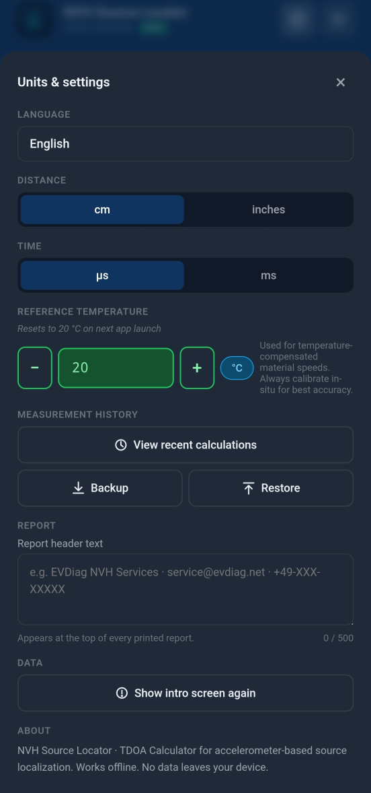

### Što se događa kada je temperatura ≠ 20 °C

- Polja vremena kalibracije automatski se popunjavaju brzinom prilagođenom temperaturi
- Izbornik Materials istaknuto prikazuje prilagođenu brzinu
- Toast potvrđuje: *„Aluminij primijenjen (6.284 m/s @ 60 °C) — ažurirano N par(ova)"*
- Savjet „Najbliži materijal" uspoređuje s brzinama prilagođenim temperaturi
- Spremljeni unosi povijesti bilježe aktivnu temperaturu
- Izvješća uključuju liniju podnožja: *„Referentna temperatura: 60 °C, primijenjena kompenzacija"*

### Resetiranje pri pokretanju aplikacije

Referentna temperatura **uvijek se resetira na 20 °C** kada pokrenete aplikaciju. To sprječava da zastarjele postavke iz prošle sesije mjerenja tiho utječu na današnji rad. Mala kurzivna napomena u Postavkama vas podsjeća na ovo ponašanje.

Ako želite reproducirati povijesno mjerenje na njegovoj originalnoj temperaturi, samo dodirnite unos — temperatura se automatski vraća.

### Materijali bez kompenzacije

Većina nemetalnih materijala nema pouzdane objavljene temperaturne koeficijente. Aplikacija za njih prikazuje značku **„ref only"** — njihova navedena brzina koristi se bez obzira na postavku temperature. Ako trebate točna mjerenja na ne-sobnim temperaturama za ove materijale, izvršite in-situ kalibraciju i spremite rezultat kao prilagođeni materijal.

---

## Označavanje fotografije

Nakon uspješnog izračuna, dodirnite gumb **📷 Označi fotografiju** kako biste postavili oznake senzora i izvora na fotografiju svoje postavke.

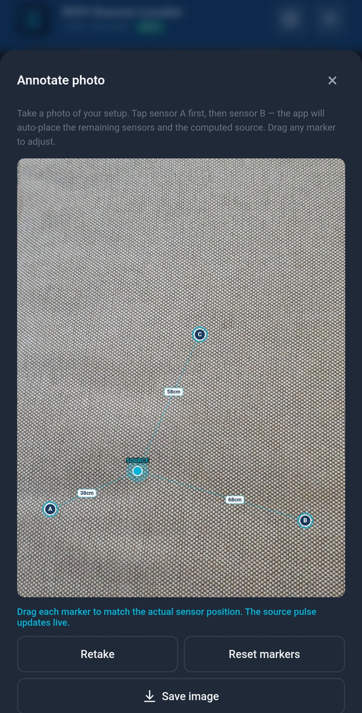

### Tijek

1. Dodirnite **Označi fotografiju** — otvara se sistemska kamera
2. Snimite fotografiju postavljanja senzora
3. Aplikacija učitava fotografiju u sloj označavanja
4. Oznake senzora (A, B, C, D, E, F prema potrebi — do 6 senzora) i oznaka izvora automatski se postavljaju na temelju vašeg izračuna
5. Povucite bilo koju oznaku za fino podešavanje položaja. Kako podešavate, položaj izvora se ponovno izračunava iz ispravljenih položaja senzora
6. Dodirnite **Spremi** za zadržavanje ili **Snimi ponovno** za novi pokušaj

Označena fotografija automatski se uključuje u PDF izvješća.

---

## Izvješća

Dodirnite gumb **Ispiši rezultat** na bilo kojem zaslonu rezultata za generiranje formatiranog izvješća.

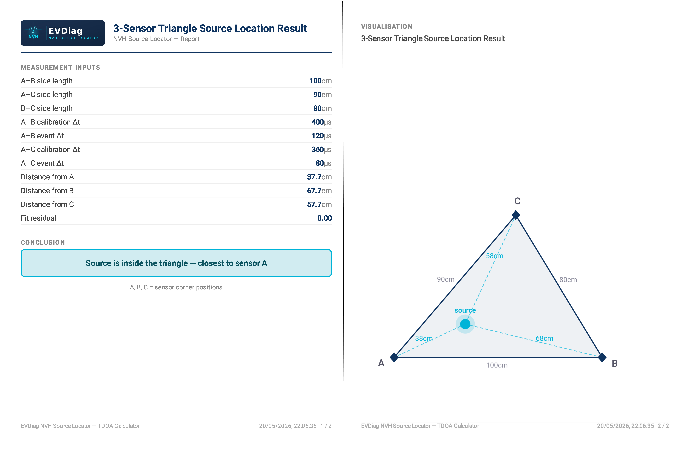

### Sadržaj izvješća

- Zaglavlje (prilagodljivo u Postavke → Zaglavlje izvješća)
- Naslov mjerenja i vremenska oznaka
- Sve ulazne vrijednosti u uredan tablici
- Rezultat izračuna
- Tekst zaključka
- Vizualizacija (geometrijski grafikon)
- Označena fotografija (ako ste je snimili)
- Linija podnožja s temperaturom (ako je kompenzacija bila aktivna)
- Broj stranice i linija zahvale

### Format izlaza

- **Android**: nativna generacija PDF-a, spremite na svoj telefon ili podijelite
- **iOS**: sistemski dijalog ispisa → spremite kao PDF, AirPrint ili podijelite

### Prilagodba zaglavlja

Postavke → Zaglavlje izvješća. Unesite ime svoje tvrtke, ime laboratorija, podatke projekta ili bilo što što želite na vrhu svakog izvješća.

---

## Sigurnosna kopija i vraćanje

Spremite sve svoje prilagođene materijale, favorite, postavke i povijest u jednu datoteku. Prijenos između uređaja.

### Sigurnosna kopija

Postavke → **Sigurnosna kopija** → dodirnite „Spremi datoteku sigurnosne kopije". Aplikacija generira JSON datoteku i otvara list za dijeljenje na vašem telefonu. Spremite je u svoj oblačni pogon (Google Drive, iCloud, OneDrive), pošaljite e-poštom sebi ili prenesite na bilo koji način.

### Vraćanje

Postavke → **Vraćanje** → odaberite datoteku sigurnosne kopije iz pohrane vašeg telefona. Aplikacija uvozi prilagođene materijale, favorite, povijest i postavke.

⚠️ **Vraćanje zamjenjuje vaše trenutne podatke.** Ako imate važna mjerenja na trenutnom uređaju, prvo ih sigurnosno kopirajte prije vraćanja iz druge sigurnosne kopije.

---

## Postavke

Pristup putem ikone zupčanika ⚙ u gornjem desnom kutu. Postavke su modalni prozor, nisu kartica.

| Postavka | Što kontrolira |
|---|---|
| **Nadogradnja na Pro** | Kupite ili saznajte više o Pro značajkama ($19,99) |
| **Jezik** | Jezik prikaza aplikacije (podržano 30) |
| **Tema** | Svjetla, Tamna ili Auto (slijedi sustav) |
| **Mjerna jedinica udaljenosti** | cm ili inči |
| **Referentna temperatura** | Aktivna temperatura za kompenzaciju, -40 do +200 °C |
| **Zaglavlje izvješća** | Prilagođeni tekst na vrhu generiranih izvješća |
| **Sigurnosna kopija** | Izvoz svih podataka u datoteku |
| **Vraćanje** | Uvoz podataka iz datoteke sigurnosne kopije |
| **Vrati kupnju** | Ponovno preuzmite Pro na novom uređaju |

---

## Pro značajke

NVH Source Locator koristi **freemium model s zaključanim značajkama**:

- **Besplatno**: Kartica 2-Sensor potpuno je funkcionalna bez ograničenja
- **Pro**: Sve druge kartice imaju određena polja za unos zaključana. Paywall se pojavljuje kada besplatni korisnik dodirne zaključano polje

### Što je zaključano

Polja koja zahtijevaju Pro raspoređena su u:
- 3-Sensor, 3-Sen+, 4-Sensor, 4-Sen+
- 3D i 3D+ načine
- Sigurnosnu kopiju i Vraćanje
- PDF izvješća
- Prilagođene materijale
- Označavanje fotografije

Besplatni korisnik može OTVORITI bilo koju karticu i VIDJETI sučelje. Jednostavno ne može unijeti vrijednosti u Pro-zaključana polja za unos.

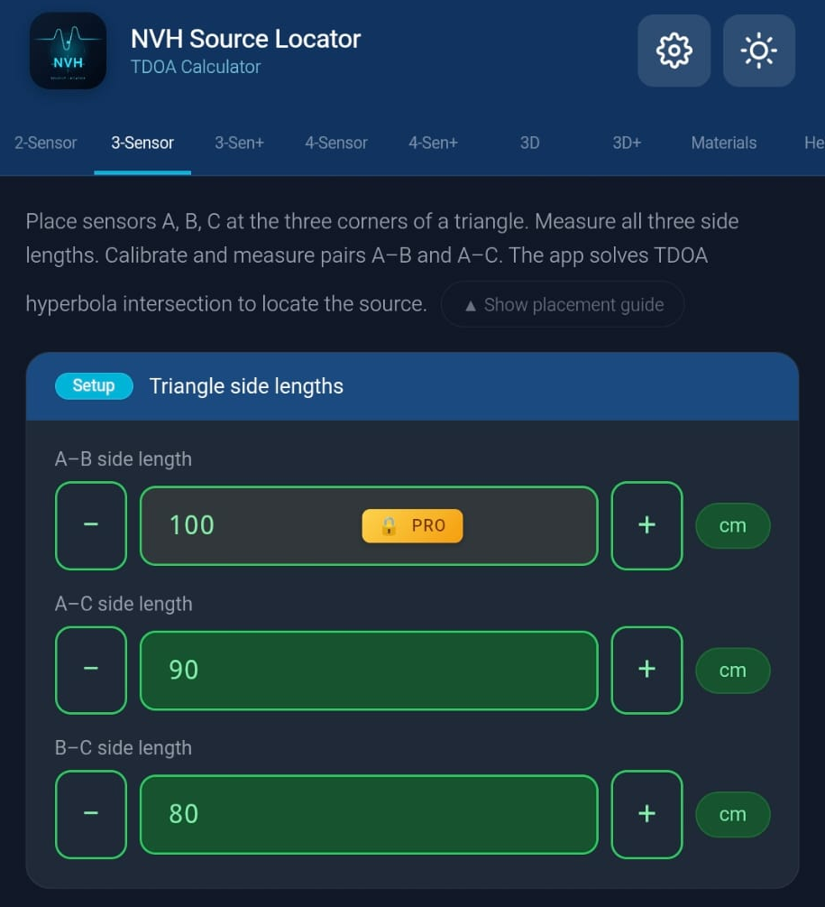

### Paywall

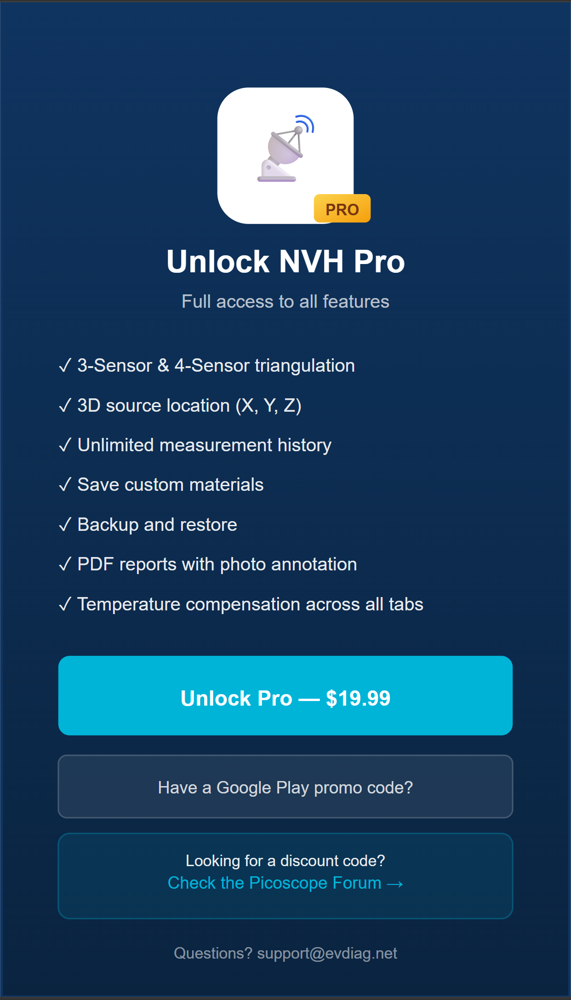

Kada besplatni korisnik dodirne zaključano polje, paywall klizi prikazujući:
- Ikonu aplikacije s PRO značkom
- Popis značajki
- Gumb za otključavanje s cijenom ($19,99 zadano; može varirati po regiji)
- Iskorištavanje promo koda (samo Android — iOS koristi Appleov zasebni proces Offer Code)
- Neobavezni promotivni link za kanale zajednice

### Kupnja Pro

Dodirnite bilo koje zaključano polje ili dodirnite **Nadogradnja na Pro** u Postavkama. Koristi službeni sustav plaćanja vaše platforme (Google Play na Androidu, Apple App Store na iOS).

### Vraćanje Pro na novom uređaju

Ako ste kupili na jednom uređaju i želite Pro na drugom (isti račun):

1. Prijavite se na **isti** Google račun (Android) ili Apple ID (iOS) koji ste koristili za kupnju
2. Otvorite NVH Source Locator na novom uređaju
3. Idite na Postavke → **Vrati kupnju**
4. Aplikacija provjerava zapise kupnji platforme i otključava Pro

### Automatsko vraćanje pri pokretanju

Ako iskoristite promo kod u Google Play Storeu ili App Storeu dok NVH Source Locator radi u pozadini, povratak u aplikaciju automatski detektira novu kupnju i otključava Pro — nije potrebno ručno Vraćanje.

### Iskorištavanje promo koda

**Android**: gumb „Imate Google Play promo kod?" u paywallu otvara Google Play proces iskorištavanja s vašim unaprijed popunjenim kodom.

**iOS**: Politika App Storea 3.1.1 zahtijeva iskorištavanje putem Appleovog službenog procesa „Iskoristi kod". Gumb Google Play sakriven je na iOS-u. Umjesto toga potražite „Iskoristi kod App Storea" u Postavkama.

---

## Kartica Help i tutorijali

Kartica **Help** uključuje tutorijale u aplikaciji, vodiče najboljih praksi i referentne informacije.

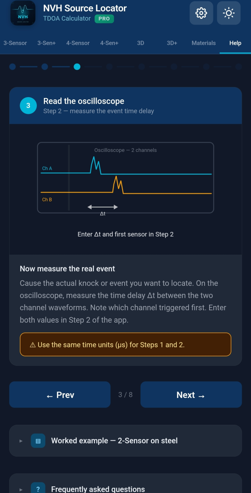

Pokrivene teme:
- Koju opremu trebate
- Kako postaviti senzore za najbolju točnost
- Savjeti za kalibraciju
- Uobičajeni scenariji mjerenja
- Savjeti za triangulaciju i 3D postavljanja
- Vođenje kabela i kvaliteta signala

---

## Rješavanje problema

### Rezultat izračuna je pogrešan ili nema smisla

1. Provjerite kalibraciju. Automatski popunjen `tCal` pretpostavlja objavljenu brzinu materijala — stvarni materijali variraju. Najtočnija kalibracija je in-situ: dodirnite poznatu lokaciju i pustite aplikaciju da izvuče stvarnu brzinu.
2. Provjerite postavku **Prvi senzor** — koji senzor je prvi čuo događaj važno je za matematiku.
3. Provjerite svoja mjerenja udaljenosti. Pogreške od nekoliko mm se šire.

### Toast kaže „Rezultat izvan raspona"

Matematika kaže da izvor nije između vaših senzora. Mogući uzroci:
- Izvor je zapravo izvan linije/ravnine senzora
- Jedan od vaših ulaza je pogrešan
- Brzina kalibracije previše je daleko od stvarnosti

### Savjet za izračunatu brzinu prikazuje boju upozorenja

Implicirana brzina zvuka iz vaših ulaza daleko je od bilo kojeg uobičajenog materijala (manje od 50 m/s ili više od 20 000 m/s). Provjerite svoje ulaze — vjerojatno tipfeler u tCal ili udaljenosti.

### Izbornik Materials prikazuje različite brzine od očekivanih

Provjerite Referentnu temperaturu u Postavkama. Ako nije 20 °C, prikazane brzine odražavaju temperaturnu kompenzaciju. Aplikacija prikazuje „ref X @ 20°C" ispod kompenziranih brzina kako biste mogli provjeriti.

### Unos povijesti reproducira se s drugim rezultatom

Stari unosi povijesti stvoreni prije verzije aplikacije 1.75 možda nisu pohranili temperaturu. Ako ste izvršili mjerenje na ne-20 °C temperaturi, reprodukcija će koristiti trenutnu postavku. Ručno postavite temperaturu u Postavkama prije reprodukcije, ILI ponovno mjerite.

### Oznake označavanja fotografije nisu tamo gdje očekujem

Oznake se automatski postavljaju na temelju ulazne geometrije. Povucite ih za prilagodbu. Prilagodba oznaka ažurira položaj izvora u sloju fotografije — ali NE mijenja temeljni rezultat izračuna.

### Sigurnosna kopija/Vraćanje ne uspijeva

Provjerite koristite li datoteku sigurnosne kopije generiranu istom ili novijom verzijom aplikacije. Stariji backup datoteke možda nemaju trenutna polja podataka.

### Vraćanje kupnje kaže „nije pronađena kupnja"

1. Provjerite jeste li prijavljeni na isti račun trgovine koji ste koristili za kupnju
2. Provjerite da kupnja nije vraćena ili istekla
3. Pokušajte deinstalirati i ponovno instalirati aplikaciju (kupnja je vezana uz vaš račun trgovine, a ne uz instalaciju aplikacije)
4. Kontaktirajte support@evdiag.net ako problem traje

### Numerički unos neočekivano se postavlja na 0

Po dizajnu: kada izađete iz numeričkog polja (dodirnete drugdje), ako je prazno, negativno ili sadrži ne-numerički tekst, postavlja se na 0. Sprječava tiho slomljene izračune iz slučajno obrisanih unosa. Unos temperature je izuzet (umjesto toga ograničava se na -40/+200).

### Trebam više pomoći

Kontaktirajte `support@evdiag.net` s:
- Modelom uređaja i verzijom OS-a
- Verzijom aplikacije (Postavke → dno stranice)
- Opisom onoga što ste pokušali
- Snimkama zaslona ako je moguće

---

*NVH Source Locator razvija EVDiag. Posjetite https://evdiag.net za ažuriranja i resurse.*
